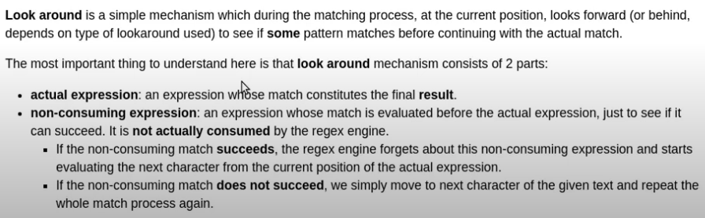
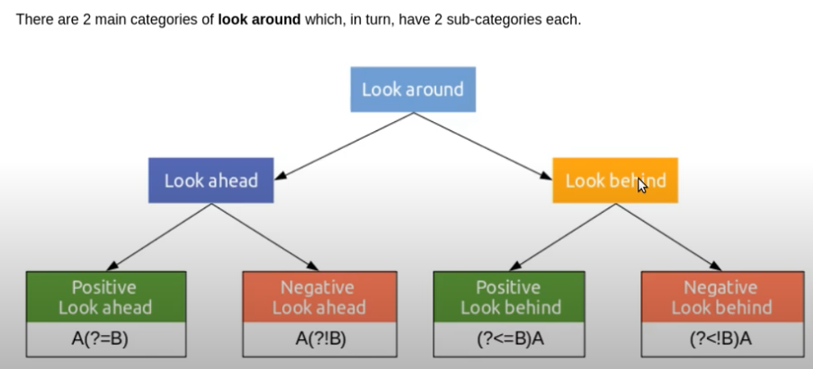
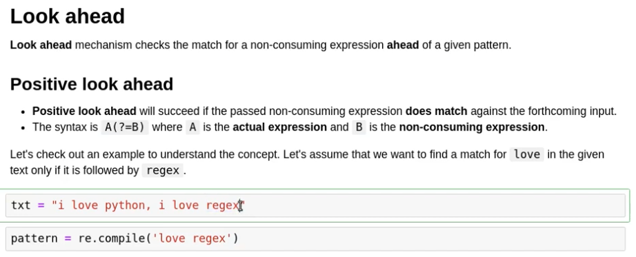

# BeautifulSoap Cheat Sheet

## Convert between html


```python
from bs4 import BeautifulSoup

markup = '<a href="http://example.com/">I linked to <i>example.com</i></a>'
soup = BeautifulSoup(markup, 'html.parser')
a_tag = soup.a
a_tag.i.unwrap()
```


    <i></i>


```python
soup.decode(formatter=None)
```


    '<a href="http://example.com/">I linked to example.com</a>'


## To delete html tags
- clear()
- extract()
- unwrap()


```python
from bs4 import BeautifulSoup

markup = '<a href="http://example.com/">I linked to <i>example.com</i></a>'
soup = BeautifulSoup(markup, 'html.parser')
a_tag = soup.a
a_tag
```


    <a href="http://example.com/">I linked to <i>example.com</i></a>


```python
i_tag = soup.i
i_tag
```


    <i>example.com</i>


```python
i_tag.clear()
i_tag
```


    <i></i>


```python
a_tag
```


    <a href="http://example.com/">I linked to <i></i></a>


```python
i_tag.extract()
i_tag
```


    <i></i>


```python
a_tag
```


    <a href="http://example.com/">I linked to </a>


```python
markup = '<a href="http://example.com/">I linked to <i>example.com</i></a>'
soup = BeautifulSoup(markup, 'html.parser')
a_tag = soup.a
a_tag
```


    <a href="http://example.com/">I linked to <i>example.com</i></a>


```python
i_tag = soup.i
i_tag
```


    <i>example.com</i>


```python
i_tag.unwrap()
i_tag
```


    <i></i>


```python
a_tag
```


    <a href="http://example.com/">I linked to example.com</a>


```python

```

## Check html tags
- get the name: Tag.name
- get all content about the element: Tag.contents
- check if the elements are html tag: isinstance(elem, Tag)


```python
from bs4 import BeautifulSoup

soup = BeautifulSoup('<div><span></span></div>')
print(soup.find('div').name)
```

    div


```python
# sample code

if isinstance(elem, Tag) and elem.name == "img":
    pass
```


      File "<ipython-input-17-1efd615b9b70>", line 3
        if isinstance(elem, Tag) and elem.name == "img"
                                                       ^
    SyntaxError: invalid syntax


```python
p_tag = bs.find("p")
elem = p_tag.contents[0]
```

About bs.Tag, see [here](https://www.crummy.com/software/BeautifulSoup/bs4/doc/#name)
```Python
tag.name = "blockquote"
tag
# <blockquote class="boldest">Extremely bold</blockquote>

tag = BeautifulSoup('<b id="boldest">bold</b>', 'html.parser').b
tag['id']
# 'boldest'
```
                         

## Search on BS object
- find specific tag
- find all tag in same level (disable recursive)
- find tag with attribute, or with specific value in targeted attr
- fetch attr value


```python
# get one element and the first element
# https://stackoverflow.com/questions/47818858/python-getting-the-first-child-of-the-parent-element-with-beautifulsoup4

.find('img')
```


```python
# How to check if tag <a> or/and  is the children of div on Beautiful Soup
# https://stackoverflow.com/questions/48699335/how-to-check-if-tag-a-or-and-img-is-the-children-of-div-on-beautiful-soup

tag.find_all(recursive=False)
```


```python
"""
Q: find tag with attr?

A: Sure, you can
https://stackoverflow.com/a/31417182/1911726
"""

html = '<p></p><p><p class="caption">Hudutu baruru with falmo, a coconut-based seafood stew. [Photograph: Wes Güity and Milton Güity]</p><p>Many dishes comprise the world of Garifuna cuisine.</p><p></p><p><p class="caption">[Photograph: Wes Güity and Milton Güity]</p><p>The Garifuna origin story is a complex one that involves attempts to enslave.</p>'
from bs4 import BeautifulSoup

soup = BeautifulSoup(html, 'html.parser')
p_tag = soup.find("p")
p_tag
```


    <p></p>


```python
p_tag = soup.find_all("p", attrs={"class":"caption"})
p_tag
```


    [<p class="caption">Hudutu baruru with falmo, a coconut-based seafood stew. [Photograph: Wes Güity and Milton Güity]</p>,
     <p class="caption">[Photograph: Wes Güity and Milton Güity]</p>]


```python
p_tag = soup.find("p", attrs={"class":"caption"})
p_tag
```


    <p class="caption">Hudutu baruru with falmo, a coconut-based seafood stew. [Photograph: Wes Güity and Milton Güity]</p>


```python
p_tag.has_attr("class")
```


    True


```python
p_tag.get("class")
```


    ['caption']


```python
"""
More complicated case
"""

html = '<p></p><p><p class="caption">Hudutu baruru with falmo, a coconut-based seafood stew. [Photograph: Wes Güity and Milton Güity]</p><p>Many dishes comprise the world of Garifuna cuisine.</p><p></p><p><p class="caption">[Photograph: Wes Güity and Milton Güity]</p><p>The Garifuna origin story is a complex one that involves attempts to enslave.</p>'
from bs4 import BeautifulSoup

soup = BeautifulSoup(html, 'html.parser')
p_tag = soup.find("p")
p_tag
```


    <p></p>


```python
p_next_sibling = p_tag.find_next_sibling("p")
p_next_sibling
```


    <p><p class="caption">Hudutu baruru with falmo, a coconut-based seafood stew. [Photograph: Wes Güity and Milton Güity]</p><p>Many dishes comprise the world of Garifuna cuisine.</p><p></p><p><p class="caption">[Photograph: Wes Güity and Milton Güity]</p><p>The Garifuna origin story is a complex one that involves attempts to enslave.</p></p></p>


```python
p_next_next = p_next_sibling.find("p", attrs={"class":"caption"})
p_next_next
```


    <p class="caption">Hudutu baruru with falmo, a coconut-based seafood stew. [Photograph: Wes Güity and Milton Güity]</p>


```python
p_next_next.find("p", attrs={"class":"caption"})
```


```python

```

## Fetch content of html tags


```python
# Another common task is extracting all the text from a page:
html_doc = """<html><head><title>The Dormouse's story</title></head>
<body>
<p class="title"><b>The Dormouse's story</b></p>

<p class="story">Once upon a time there were three little sisters; and their names were
<a href="http://example.com/elsie" class="sister" id="link1">Elsie</a>,
<a href="http://example.com/lacie" class="sister" id="link2">Lacie</a> and
<a href="http://example.com/tillie" class="sister" id="link3">Tillie</a>;
and they lived at the bottom of a well.</p>

<p class="story">...</p>
"""


print(soup.get_text())
# The Dormouse's story
#
# The Dormouse's story
#
# Once upon a time there were three little sisters; and their names were
# Elsie,
# Lacie and
# Tillie;
# and they lived at the bottom of a well.
#
# ...
```


```python

```

## Level-manipuation
- sibling operation: find_next_sibling
    - From official guide, .next_element and .previous_element; .next_elements and .previous_elements


```python
html_doc = """<html><head><title>The Dormouse's story</title></head>
<body>
<p class="title"><b>The Dormouse's story</b></p>

<p class="story">Once upon a time there were three little sisters; and their names were
<a href="http://example.com/elsie" class="sister" id="link1">Elsie</a>,
<a href="http://example.com/lacie" class="sister" id="link2">Lacie</a> and
<a href="http://example.com/tillie" class="sister" id="link3">Tillie</a>;
and they lived at the bottom of a well.</p>
"""

from bs4 import BeautifulSoup

soup = BeautifulSoup(html_doc, 'html.parser')
p_first = soup.find("p")
p_first
```


    <p class="title"><b>The Dormouse's story</b></p>


```python
type(p_first)
```


    bs4.element.Tag


```python
p_next_siblings = p_first.find_next_siblings("p")
p_next_siblings
```


    [<p class="story">Once upon a time there were three little sisters; and their names were
     <a class="sister" href="http://example.com/elsie" id="link1">Elsie</a>,
     <a class="sister" href="http://example.com/lacie" id="link2">Lacie</a> and
     <a class="sister" href="http://example.com/tillie" id="link3">Tillie</a>;
     and they lived at the bottom of a well.</p>]


```python
p_next_sibling = p_first.find_next_sibling("p")
p_next_sibling
```


    <p class="story">Once upon a time there were three little sisters; and their names were
    <a class="sister" href="http://example.com/elsie" id="link1">Elsie</a>,
    <a class="sister" href="http://example.com/lacie" id="link2">Lacie</a> and
    <a class="sister" href="http://example.com/tillie" id="link3">Tillie</a>;
    and they lived at the bottom of a well.</p>


```python
p_next_sibling.name
```


    'p'


```python
p_next_sibling.text
```


    'Once upon a time there were three little sisters; and their names were\nElsie,\nLacie and\nTillie;\nand they lived at the bottom of a well.'


```python
p_next_next_ = p_next_sibling.find_next_sibling("p")
# p_next_next
```


```python
p_next_sibling.find_next_sibling("p") == None
```


    True


```python

```


```python

```

# Regex

## About major functions
- re.match(pattern, string)
Match 顾名思义, 查看string是否match, 所以是从string的beginning开始配对. Return a match object

- re.search(pattern, string)
This function is especially useful for determining if a pattern exists in a string. Also, it return a match object.

- re.findall(pattern, string)
Finds all occurrences of a pattern in a string. Doesn't return a match object.

- re.finditer(pattern, string)
Return an iterator yielding match objects.

re.search(pattern, string, flags=0)

Ref: https://docs.python.org/3/library/re.html

(Dot.) In the default mode, this matches any character except a newline. If the DOTALL flag has been specified, this matches any character including a newline.

### flags


```python
"""
Example 1
Consider a scenario where we want to find all the lines in the given text which start with the pattern Name:.
"""
txt = """
Name:
Age: 0
Roll No.: 15
Grade: S

Name: Ravi
Age: -1
Roll No.: 123 Name: ABC
Grade: K

Name: Ram
Age: N/A
Roll No.: 1
Grade: G
"""

pattern = re.compile("^Name: \w+")
pattern.findall(txt)


```


    []


```python
pattern = re.compile("^Name: \w+", flags=re.M)
pattern.findall(txt)
```


    ['Name: Ravi', 'Name: Ram']


> re.M (short for re.MULTILINE) is a flag which is used to make begin/end (^, $) consider each line.


### Escape characters


|   |   |
|---|---|
| "  | \"  |
| '  | \'  |
| (  | \(  |
| [  | \[  |

## Boundary Matchers


```python

import re

txt = """
Lorem Ipsum is simply dummy text of the printing and typesetting industry. 
Lorem Ipsum has been the industry's standard dummy text ever since the 1500s, 
when an unknown printer took a galley of type and scrambled it to make a type specimen book. 
It has survived not only five centuries, but also the leap into electronic typesetting, 
remaining essentially unchanged. 
It was popularised in the 1960s with the release of Letraset sheets containing Lorem Ipsum passages, 
and more recently with desktop publishing software like Aldus PageMaker including versions of Lorem Ipsum.
"""

pattern = re.compile("and|or|the")
pattern.findall(txt)


```


    ['or',
     'the',
     'and',
     'or',
     'the',
     'and',
     'the',
     'and',
     'the',
     'the',
     'the',
     'or',
     'and',
     'or',
     'or']


```python
"""
Above would match words like "Lorem", "standard", etc.
So need a way to narrow down the search to word
"""
```


    '\nL<span class="query">or</span>em Ipsum is simply dummy text of <span class="query">the</span> printing <span class="query">and</span> typesetting industry. \nL<span class="query">or</span>em Ipsum has been <span class="query">the</span> industry\'s st<span class="query">and</span>ard dummy text ever since <span class="query">the</span> 1500s, \nwhen an unknown printer took a galley of type <span class="query">and</span> scrambled it to make a type specimen book. \nIt has survived not only five centuries, but also <span class="query">the</span> leap into electronic typesetting, \nremaining essentially unchanged. \nIt was popularised in <span class="query">the</span> 1960s with <span class="query">the</span> release of Letraset sheets containing L<span class="query">or</span>em Ipsum passages, \n<span class="query">and</span> m<span class="query">or</span>e recently with desktop publishing software like Aldus PageMaker including versions of L<span class="query">or</span>em Ipsum.\n'


`\b(and|or|the)\b`

where `\b` is a metacharacter that matches at a position that is called a **word boundary**.
Such identifiers that correspond to a particular position inside of the input are called **Boundary Matchers**.

Note: Since `\b` is also an escape sequence for strings in Python, we need to escape it using `\`, i.e. `\\b`, in order to treat it like a metacharacter for regex matching.


```python
print("\b(and|or|the)\b") # \b needs to be escaped
```

    (and|or|the


```python
print("\\b(and|or|the)\\b")
```

    \b(and|or|the)\b


Matcher	Description
^	Matches at the beginning of a line
$	Matches at the end of a line
\b	Matches a word boundary
\B	Matches the opposite of \b. Anything that is not a word boundary
\A	Matches the beginning of the input
\Z	Matches the end of the input

|  Matcher |  Description |
|---|---|
|  ^ | Matches at the beginning of a line  |
| $  |  Matches at the end of a line |
|  \b |  Matches a word boundary |
| \B  | Matches the opposite of \b. Anything that is not a word boundary  |
| \A  | Matches the beginning of the input  |
| \Z  | Matches the end of the input  |

## Character Class

```Python
import re

>>> re.search(r"[\[]", "acd")
>>> re.search(r"[\[]", "[dafs]")
<_sre.SRE_Match object; span=(0, 1), match='['>
>>> re.search(r"[abc]", "[dafs]")
<_sre.SRE_Match object; span=(2, 3), match='a'>
>>> re.search(r"[abc]", "[xxxx]")
>>> re.search(r"[abc]", "xxxx")
>>> 
>>> 
>>> re.search(r"[abc]", "xxax")
<_sre.SRE_Match object; span=(2, 3), match='a'>
>>> 
>>> re.search(r"[\a]", "xxax")
>>> 
>>> 
>>> re.search(r"[^a]", "xxax")
<_sre.SRE_Match object; span=(0, 1), match='x'>
>>> 
>>> 
>>> 
>>> re.search(r"[^a]", "xxbx")
<_sre.SRE_Match object; span=(0, 1), match='x'>
>>> re.search(r"[^abx]", "xxbx")
>>> 
>>> 
>>> re.search(r"[^adx]", "xxbx")
<_sre.SRE_Match object; span=(2, 3), match='b'>
>>> 
>>> 
>>> re.search(r"[^adx]", "xxbx")


About special characters
>>> re.search(r"[\[]", "[")
<_sre.SRE_Match object; span=(0, 1), match='['>
```

## Grouping and capturing
- parenthesis create **grouping, not capturing**
- Parentheses Create Numbered Capturing Groups

Example:
The regex `Set(Value)?` matches `Set` or `SetValue`. In the first case, the first (and only) capturing group remains empty. In the second case, the first capturing group matches Value.

### Applications of grouping

[Tutorial](https://www.regular-expressions.info/brackets.html)

1. apply a **quantifier** to the entire group.
2. restrict **alternation** to part of the regex.
3. **capture** the text matched by group.


```python
"""
Demo for apply a quantifier to the entire group
"""
import re
txt = "abbbbbabbbb"

pattern1 = re.compile("ab+")
pattern2 = re.compile("(ab)+")

pattern1.match(txt)
```


    <re.Match object; span=(0, 6), match='abbbbb'>


```python
pattern2.match(txt)
```


    <re.Match object; span=(0, 2), match='ab'>


```python
"""
Demo for restrict alternation to part of the regex.
"""
txt = """
my name is ram
my name is sam
"""

pattern1 = re.compile("my name is ram|sam")
pattern2 = re.compile("my name is (ram|sam)")

pattern1.findall(txt)
```


    ['my name is ram', 'sam']


```python
pattern2.findall(txt)
```


    ['ram', 'sam']


```python
"""
Demo for capturing the text matched by group.
"""

txt = "12/02/2019"
pattern = re.compile("(\d{2})\/(\d{2})\/(\d{4})")
match = pattern.match(txt)
# group 0: matches entire regex pattern
match.group(0)
```


    '12/02/2019'


```python
# group 1: match 1st group
match.group(1)
```


    '12'


```python
match.group(2)
```


    '02'


```python
match.group(3)
```


    '2019'


```python
"""
More examples, from html parsing
"""

import re

match_grp = re.search(r"\[(.*?)\]", "The fastest, freshest ice cream you'll ever make. [Photographs: Vicky Wasik]")
match_grp
```


    <re.Match object; span=(50, 76), match='[Photographs: Vicky Wasik]'>


```python
match_grp.groups()[0]
```


    'Photographs: Vicky Wasik'


```python
"""
Another example using re.findall or re.finditer, as well as match.groups()

Particularly, the difference between match.group(), match.groups(), match.group(1), match.group(2)
"""

html = '<h2>Special equipment</h2><certain_tag id="nordic-ware-natural-aluminum-commercial-bakers-half-sheet" class="text">Rimmed baking sheet</dorado>, <certain_tag id="fine-mesh-strainers" class="text">fine-mesh strainer</dorado>'

re.findall('<certain_tag +id="([^"]+?)?" class="text">([^<]+?)<\/dorado>', html)
```


    [('nordic-ware-natural-aluminum-commercial-bakers-half-sheet',
      'Rimmed baking sheet'),
     ('fine-mesh-strainers', 'fine-mesh strainer')]


```python
matches = re.finditer('<certain_tag +id="([^"]+?)?" class="text">([^<]+?)<\/dorado>', html)

for match in matches:
    id = match.group(1)
    text = match.group(2)
    
    print("match: ", match)
    print("{}, {}".format(id, text))
    print("match.group(): ", match.group())
    print("match text: ", match.string)
    print("match.groups(): ", match.groups())
    print("--------------")
```

    match:  <re.Match object; span=(26, 143), match='<certain_tag id="nordic-ware-natural-aluminum-com>
    nordic-ware-natural-aluminum-commercial-bakers-half-sheet, Rimmed baking sheet
    match.group():  <certain_tag id="nordic-ware-natural-aluminum-commercial-bakers-half-sheet" class="text">Rimmed baking sheet</dorado>
    match text:  <h2>Special equipment</h2><certain_tag id="nordic-ware-natural-aluminum-commercial-bakers-half-sheet" class="text">Rimmed baking sheet</dorado>, <certain_tag id="fine-mesh-strainers" class="text">fine-mesh strainer</dorado>
    match.groups():  ('nordic-ware-natural-aluminum-commercial-bakers-half-sheet', 'Rimmed baking sheet')
    --------------
    match:  <re.Match object; span=(145, 223), match='<certain_tag id="fine-mesh-strainers" class="text>
    fine-mesh-strainers, fine-mesh strainer
    match.group():  <certain_tag id="fine-mesh-strainers" class="text">fine-mesh strainer</dorado>
    match text:  <h2>Special equipment</h2><certain_tag id="nordic-ware-natural-aluminum-commercial-bakers-half-sheet" class="text">Rimmed baking sheet</dorado>, <certain_tag id="fine-mesh-strainers" class="text">fine-mesh strainer</dorado>
    match.groups():  ('fine-mesh-strainers', 'fine-mesh strainer')
    --------------


```python
"""Python
match.group(...) method of _sre.SRE_Match instance
    group([group1, ...]) -> str or tuple.
    Return subgroup(s) of the match by indices or names.
    For 0 returns the entire match.
    
"""
```


    'Python\nmatch.group(...) method of _sre.SRE_Match instance\n    group([group1, ...]) -> str or tuple.\n    Return subgroup(s) of the match by indices or names.\n    For 0 returns the entire match.\n    \n'


### Backreferencing
主要的几个用途
- 找到之前出现的string, 查重
- 替换位置, `re.sub`

remember:
- \0 means the whole original string
- start from \1, matched with the real groups


```python
m = re.search(r"\w+", "hello")
print(m.group(0))
# print(m.group(1)) # would fail because no group(1)
```

    hello


```python
# example of find duplicated words

txt = """
hello hello
how are you
bye bye
"""

pattern = re.compile("(\w+) \\1")
pattern.findall(txt)
```


    ['hello', 'bye']


```python
# use raw strings

pattern = re.compile(r"(\w+) \1")
pattern.findall(txt)
```


    ['hello', 'bye']


```python
# example of using back referencing to shift positions

txt = """
today is 23/02/2019.
yesterday was 22/02/2019.
tomorrow is 24/02/2019.
"""
pattern = re.compile("(\d{2})\/(\d{2})\/(\d{4})")
pattern.findall(txt)
```


    [('23', '02', '2019'), ('22', '02', '2019'), ('24', '02', '2019')]


```python
newtxt = pattern.sub(r"\3-\2-\1", txt)
print(newtxt)
```

    
    today is 2019-02-23.
    yesterday was 2019-02-22.
    tomorrow is 2019-02-24.
    


**>注意, 上面的例子用了多行multi-line的模式, 每一行都是一个新的regex match过程**


```python
# example of using backreferencing to replace position in html parsing

html = '<h2> Header text <strong>  </strong> </h2>'
text = re.sub(
            "[^>]+\s*(]*?>)\s*(</strong>)?\s*</h2>",
            "\\2</h2>\\1",
            html,
            re.MULTILINE,
        )
print(text)
```

    <h2> Header text <strong></strong></h2>


### Non-Capturing Groups

网上的一种理解, 对于non-capturing groups
>A non-capturing group lets us use the grouping inside a regular expression without changing the numbers assigned to the back references (explained in the next section). This can be very useful in building large and complex regular expressions.


```python
## Classic tutorial for non-capturing groups

import re

txt = """
i love cats
i love dogs
"""

pattern = re.compile("i love (cats|dogs)")
pattern.findall(txt)
```


    ['cats', 'dogs']


```python
for match in pattern.finditer(txt):
    print("Complete regex match (default):", match.group(0))
    print("Match captured by 1st group:", match.group(1))
    # cats, dogs其实不是我关心的, 我需要得到的是i love cats, i love dogs
    # 这里的 group不是我所想要的
```

    Complete regex match (default): i love cats
    Match captured by 1st group: cats
    Complete regex match (default): i love dogs
    Match captured by 1st group: dogs


```python
# 使用non-capturing

pattern = re.compile("i love (?:cats|dogs)")
pattern.findall(txt)
```


    ['i love cats', 'i love dogs']


```python
for m in pattern.finditer(txt):
    print("Matched group:", m)
```

    Matched group: <re.Match object; span=(1, 12), match='i love cats'>
    Matched group: <re.Match object; span=(13, 24), match='i love dogs'>


## Non-greedy search, or find the first matched one
- adding ? after (+,*)


```python
import re

re.search('<p></p>')
```


    ---------------------------------------------------------------------------

    TypeError                                 Traceback (most recent call last)

    <ipython-input-1-1cf272b0f03e> in <module>
          1 import re
          2 
    ----> 3 re.search('<p></p>')
    

    TypeError: search() missing 1 required positional argument: 'string'


```python

```

## escape character cases


```python

```

### Impressive regular expression

#### Matched img url
`pattern = '^https?:\\/\\/(www\\.)?%s(.+(jpeg|jpg|png))$'`, match `https://xxxx.jpg`


## Comparison between functions
- match()
- group()
- search()
- finditer

## Look around




### Look ahead




```python

```
